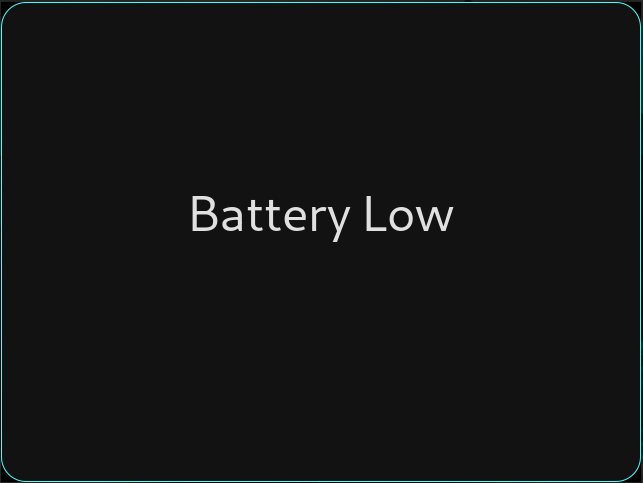

# Battery-Alert

This is a simple program that warns the user when the battery is low.
It is very useful especially if you are like me and you forget to look at your
battery level on the i3 bar and then suddenly your laptop shutdown.
